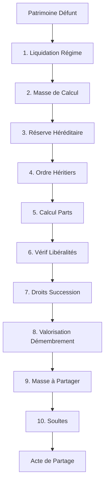

# 📖 Méthodes de Calcul de Succession - Documentation Juridique

## 🇸🇳 Cadre Légal Sénégalais

Cette documentation détaille les **10 méthodes de calcul** implémentées dans le module de succession, conformes au :
- **Code de la Famille** (Loi n° 72-61 du 12 juin 1972)
- **Code Général des Impôts** (Droits de succession)
- **Jurisprudence OHADA** (aspects commerciaux)

---

## 📋 Table des Matières

1. [Liquidation du Régime Matrimonial](#1-liquidation-du-régime-matrimonial)
2. [Masse de Calcul (Rapport des Donations)](#2-masse-de-calcul)
3. [Réserve Héréditaire](#3-réserve-héréditaire)
4. [Ordre des Héritiers](#4-ordre-des-héritiers)
5. [Calcul des Parts](#5-calcul-des-parts)
6. [Réduction des Libéralités Excessives](#6-réduction-des-libéralités)
7. [Droits de Succession (Fiscalité)](#7-droits-de-succession)
8. [Valorisation Usufruit/Nue-Propriété](#8-valorisation-démembrement)
9. [Masse à Partager](#9-masse-à-partager)
10. [Soulte entre Cohéritiers](#10-soulte)

---

## 1. Liquidation du Régime Matrimonial

### 📜 Base Légale
**Art. 283 et suivants du Code de la Famille**

### 🎯 Objectif
Déterminer la **masse successorale** après dissolution du régime matrimonial par décès.

### 📊 Méthodes selon le Régime

#### A) Séparation de Biens
```
Masse Successorale = Biens propres du défunt - Dettes du défunt
```
- Chaque époux conserve la propriété exclusive de ses biens
- Pas de partage préalable

#### B) Communauté de Biens (Régime Légal)
```
1. Actif de communauté = Biens communs
2. Passif de communauté = Dettes communes
3. Actif net communauté = Actif - Passif
4. Part du conjoint survivant = Actif net / 2
5. Masse Successorale = Biens propres défunt + (Actif net / 2)
```

**Exemple :**
- Biens propres défunt : 50M FCFA
- Biens communs : 100M FCFA
- Dettes : 30M FCFA
- Actif net = 100M - 30M = 70M
- Part conjoint = 70M / 2 = 35M
- **Masse successorale = 50M + 35M = 85M FCFA**

#### C) Participation aux Acquêts
```
1. Calcul des acquêts = Patrimoine final - Patrimoine initial
2. Créance de participation = Acquêts × 50%
3. Masse Successorale = Biens propres + Créance
```

---

## 2. Masse de Calcul (Rapport des Donations)

### 📜 Base Légale
**Art. 700 du Code de la Famille** - Rapport des libéralités

### 🎯 Objectif
Reconstituer fictivement le patrimoine du défunt en réintégrant les donations faites de son vivant.

### 📊 Formule
```
Masse de Calcul = Actif Net Successoral + Σ(Donations rapportables)
```

### ⚖️ Donations Rapportables
**OUI :**
- Donations entre vifs notariées
- Dons manuels importants
- Avances sur héritage

**NON (exemptées) :**
- Présents d'usage (< 5% patrimoine)
- Donations hors part successorale (clause expresse)
- Frais d'établissement, mariage, études (normaux)

### 📝 Exemple
- Actif net : 100M FCFA
- Donation à Enfant 1 (2015) : 20M FCFA
- Donation à Enfant 2 (2018) : 15M FCFA
- **Masse de calcul = 100M + 20M + 15M = 135M FCFA**

---

## 3. Réserve Héréditaire

### 📜 Base Légale
**Art. 697 du Code de la Famille**

### 🎯 Objectif
Protéger les héritiers réservataires en leur garantissant une part minimale intangible.

### 📊 Barème selon les Héritiers

| Situation | Réserve Héréditaire | Quotité Disponible |
|-----------|---------------------|-------------------|
| **1 enfant** | 1/2 (50%) | 1/2 (50%) |
| **2 enfants** | 2/3 (66,67%) | 1/3 (33,33%) |
| **3+ enfants** | 3/4 (75%) | 1/4 (25%) |
| **Parents (sans enfants)** | 1/3 (33,33%) | 2/3 (66,67%) |
| **Aucun réservataire** | 0% | 100% |

### 🔒 Caractère Intangible
> La réserve héréditaire ne peut être réduite par testament. Toute disposition contraire est **NULLE** (Art. 707).

### 📝 Exemple
- Masse de calcul : 150M FCFA
- 3 enfants
- **Réserve = 150M × 75% = 112,5M FCFA**
- **Quotité disponible = 150M × 25% = 37,5M FCFA**

---

## 4. Ordre des Héritiers (Dévolution Légale)

### 📜 Base Légale
**Art. 564 à 570 du Code de la Famille**

### 📊 Hiérarchie des Ordres

```
┌─────────────────────────────────────────┐
│ ORDRE 1 : DESCENDANTS                   │
│ (Enfants, petits-enfants par représentation) │
├─────────────────────────────────────────┤
│ ORDRE 2 : ASCENDANTS + COLLATÉRAUX     │
│ (Père/Mère + Frères/Sœurs)             │
├─────────────────────────────────────────┤
│ ORDRE 3 : AUTRES COLLATÉRAUX           │
│ (Oncles/Tantes, Cousins jusqu'au 6ème degré) │
└─────────────────────────────────────────┘

Le CONJOINT SURVIVANT vient en concours ou à défaut
```

### ⚖️ Principe de Proximité
> L'héritier le plus proche en degré **exclut** les plus éloignés dans le même ordre.

### 📝 Représentation Successorale
Les petits-enfants peuvent **représenter** leur parent prédécédé :
```
Défunt
├── Enfant A (vivant) → Hérite 1/3
├── Enfant B (décédé)
│   ├── Petit-enfant B1 → Hérite 1/6 (représentation)
│   └── Petit-enfant B2 → Hérite 1/6 (représentation)
└── Enfant C (vivant) → Hérite 1/3
```

---

## 5. Calcul des Parts Héréditaires

### 📜 Base Légale
**Art. 567 à 569 du Code de la Famille**

### 📊 Cas de Figure

#### A) Descendants + Conjoint (Le plus fréquent)

**Option 1 : Usufruit (Défaut)**
```
Conjoint : Usufruit de la TOTALITÉ
Enfants : Nue-propriété en parts ÉGALES
```

**Option 2 : Pleine Propriété (sur choix)**
```
Conjoint : 1/4 en pleine propriété
Enfants : 3/4 en pleine propriété (parts égales)
```

**🔍 Valorisation fiscale :**
La valeur de l'usufruit dépend de l'âge de l'usufruitier (voir méthode 8).

#### B) Conjoint Seul (sans descendants)

| Situation | Conjoint | Autres Héritiers |
|-----------|----------|------------------|
| Avec parents OU frères/sœurs | 1/2 | 1/2 (père/mère/fratrie) |
| Seul | **100%** | - |

#### C) Descendants Seuls (sans conjoint)
```
Parts égales entre enfants : 100% ÷ nombre enfants
```

#### D) Ordre Subsidiaire
En l'absence de descendants ET conjoint :
1. Parents : 1/4 chacun (si vivants)
2. Frères/Sœurs : Reste en parts égales
3. Oncles/Tantes : Par souche

### 📝 Exemple Complet
**Situation :** Défunt + Épouse + 3 enfants  
**Actif net :** 120M FCFA  
**Option :** Usufruit (épouse 60 ans)

**Parts :**
- Épouse : Usufruit 120M (valeur fiscale : ~60M)
- Enfant 1 : Nue-propriété 40M (valeur fiscale : ~20M)
- Enfant 2 : Nue-propriété 40M (valeur fiscale : ~20M)
- Enfant 3 : Nue-propriété 40M (valeur fiscale : ~20M)

---

## 6. Réduction des Libéralités Excessives

### 📜 Base Légale
**Art. 711 du Code de la Famille** - Action en réduction

### 🎯 Objectif
Ramener les donations et legs dans les limites de la quotité disponible.

### 📊 Méthode de Réduction

```
1. Total libéralités = Donations + Legs
2. Excès = Total - Quotité Disponible
3. SI Excès > 0 :
   a) Réduction des LEGS en priorité (ordre inverse testament)
   b) Si insuffisant : Réduction DONATIONS (ordre chronologique inverse)
```

### ⚖️ Ordre de Réduction
1. **Legs particuliers** (objets spécifiques)
2. **Legs à titre universel** (quote-part)
3. **Donations les plus récentes** → les plus anciennes

### 📝 Exemple
- Quotité disponible : 30M FCFA
- Legs 1 (Fils) : 20M
- Legs 2 (Fille) : 15M
- **Total = 35M > 30M** → Excès de 5M

**Réduction proportionnelle :**
- Legs 1 réduit : 20M × (30M/35M) = **17,14M**
- Legs 2 réduit : 15M × (30M/35M) = **12,86M**

---

## 7. Droits de Succession (Fiscalité)

### 📜 Base Légale
**Code Général des Impôts** - Articles sur les droits de mutation

### 📊 Barème Sénégalais (Simplifié)

| Lien de Parenté | Abattement | Taux |
|-----------------|------------|------|
| **Conjoint** | 50M FCFA | 5% |
| **Enfants** | 50M FCFA | 5% |
| **Père/Mère** | 30M FCFA | 5% |
| **Frères/Sœurs** | 10M FCFA | 10% |
| **Autres** | 0 FCFA | 20% |

### 💰 Formule
```
Droits = (Part Héritier - Abattement) × Taux
```

### 📝 Exemple
- Part enfant : 80M FCFA
- Abattement : 50M FCFA
- Base imposable : 80M - 50M = 30M
- **Droits dus = 30M × 5% = 1,5M FCFA**

### ⏰ Délai de Paiement
**6 mois** à compter du décès (Art. CGI)  
Pénalités de retard : **10% + intérêts**

---

## 8. Valorisation Usufruit/Nue-Propriété

### 📜 Base Légale
**Barème fiscal de l'usufruit (Annexe CGI)**

### 📊 Table de Valorisation

| Âge Usufruitier | Valeur Usufruit | Valeur Nue-Propriété |
|-----------------|-----------------|----------------------|
| < 20 ans | 90% | 10% |
| 20-30 ans | 80% | 20% |
| 30-40 ans | 70% | 30% |
| 40-50 ans | 60% | 40% |
| 50-60 ans | 50% | 50% |
| 60-70 ans | 40% | 60% |
| 70-80 ans | 30% | 70% |
| > 80 ans | 20% | 80% |

### 💡 Principe
```
Valeur Pleine Propriété = 100%
Usufruit + Nue-Propriété = 100%
```

### 📝 Exemple
- Bien : Villa 100M FCFA
- Usufruitier : 55 ans
- **Usufruit = 100M × 50% = 50M**
- **Nue-propriété = 100M × 50% = 50M**

### ⚖️ Extinction de l'Usufruit
Au décès de l'usufruitier, la nue-propriété se consolide automatiquement en pleine propriété **SANS FRAIS**.

---

## 9. Masse à Partager (Imputation des Donations)

### 📜 Base Légale
**Art. 701 du Code de la Famille** - Imputation

### 🎯 Objectif
Déduire de la part de l'héritier donataire les donations déjà reçues.

### 📊 Méthode
```
Pour chaque héritier :
Part théorique - Donations reçues = À recevoir en nature

SI Donations > Part théorique → Doit rapporter l'excédent
```

### 📝 Exemple
- 3 enfants, Actif 90M
- Part théorique : 30M chacun
- Enfant A a reçu 20M en donation

**Partage :**
- Enfant A : 30M - 20M = **10M à recevoir**
- Enfant B : **30M**
- Enfant C : **30M**

### ⚠️ Donation > Part
Si Enfant A avait reçu 40M :
- Part théorique : 30M
- Excédent : 10M → **Prélèvement sur la quotité disponible**

---

## 10. Soulte entre Cohéritiers

### 📜 Base Légale
**Art. 711 du Code de la Famille** - Partage en nature

### 🎯 Définition
**Soulte** = Somme versée par un héritier qui reçoit un bien d'une valeur supérieure à sa part.

### 📊 Formule
```
Soulte = Valeur Bien Attribué - Part Théorique
```

### 📝 Exemple
- 2 enfants (parts égales 50M chacun)
- Bien 1 : Villa 70M
- Bien 2 : Terrain 30M

**Partage :**
- Enfant A reçoit la Villa (70M)
- Enfant B reçoit le Terrain (30M)
- **Soulte due par A à B = (70M - 50M) = 20M**

**Résultat équilibré :**
- A : Villa 70M - Soulte 20M = **50M net**
- B : Terrain 30M + Soulte 20M = **50M net**

### 💼 Modalités de Paiement
- Comptant (préférable)
- Échelonné sur accord des parties
- Garantie hypothécaire si différé

---

## 🔧 Utilisation dans le Calculateur

Toutes ces méthodes sont implémentées dans `/lib/succession.ts` et utilisées dans le composant `SuccessionCalculatorPro`.

### 📊 Flux de Calcul



---

## 📚 Références Juridiques

1. **Loi n° 72-61 du 12 juin 1972** - Code de la Famille (Sénégal)
2. **Code Général des Impôts** - Livre des procédures fiscales
3. **Jurisprudence Cour Suprême** - Chambre Civile
4. **Doctrine** : 
   - Professeur Abdoulaye SAKHO - *Droit des Successions au Sénégal*
   - Maître El Hadji DIOUF - *La Succession ab intestat*

---

## ⚖️ Mentions Légales

> Ces calculs sont fournis **à titre indicatif** et ne remplacent pas une consultation juridique personnalisée. 
> Chaque situation successorale présente des spécificités nécessitant l'expertise d'un avocat spécialisé.

---

**Développé par LexPremium** 🇸🇳  
*Cabinet d'Avocats - Experts en Droit des Successions*
